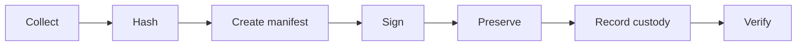
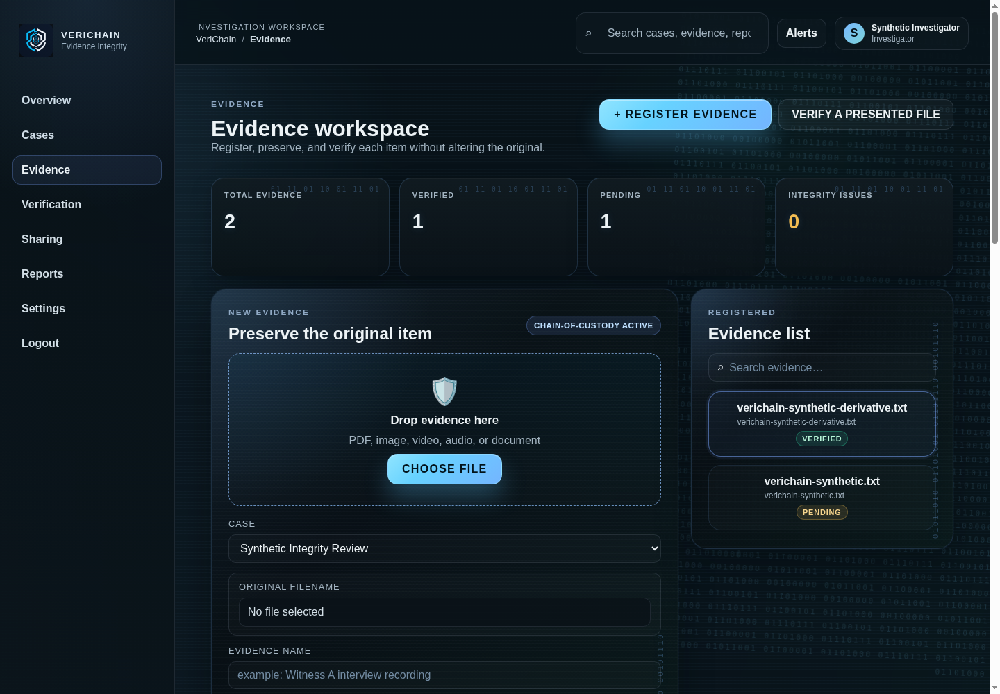
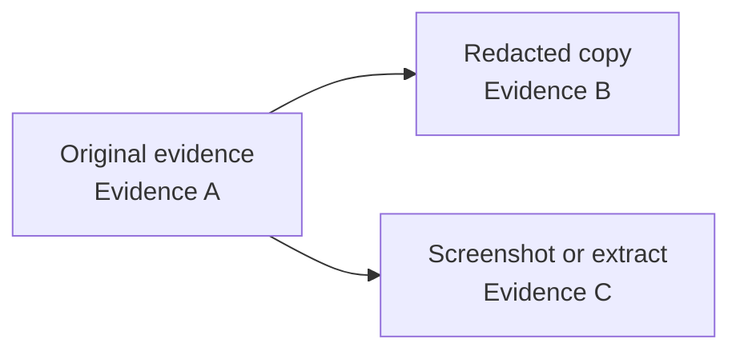
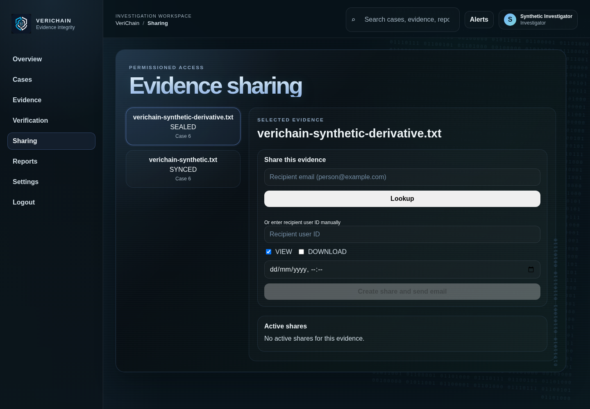
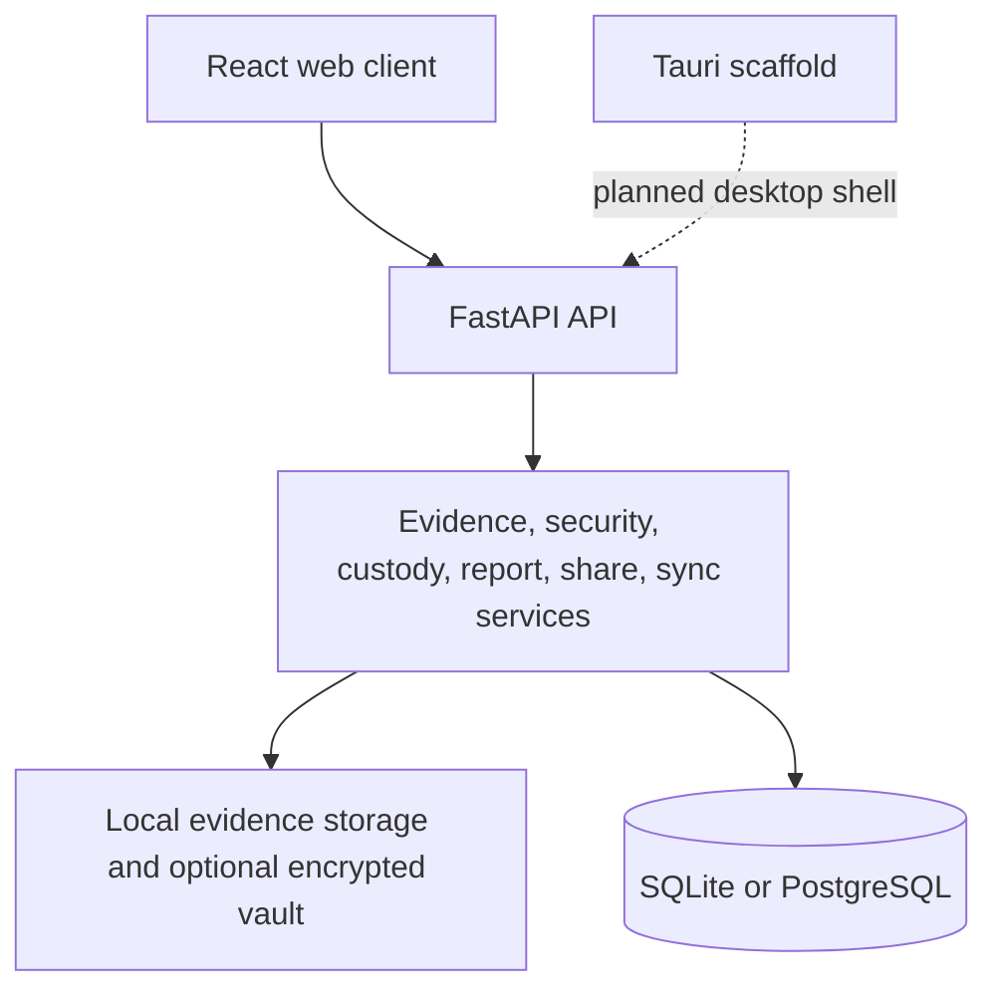
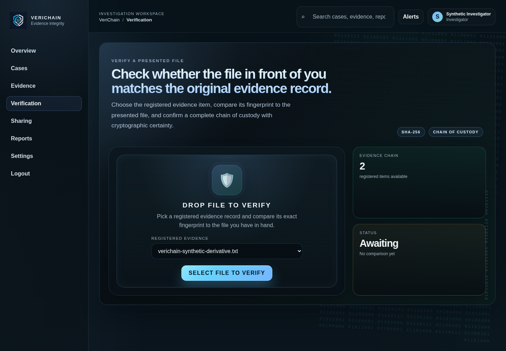
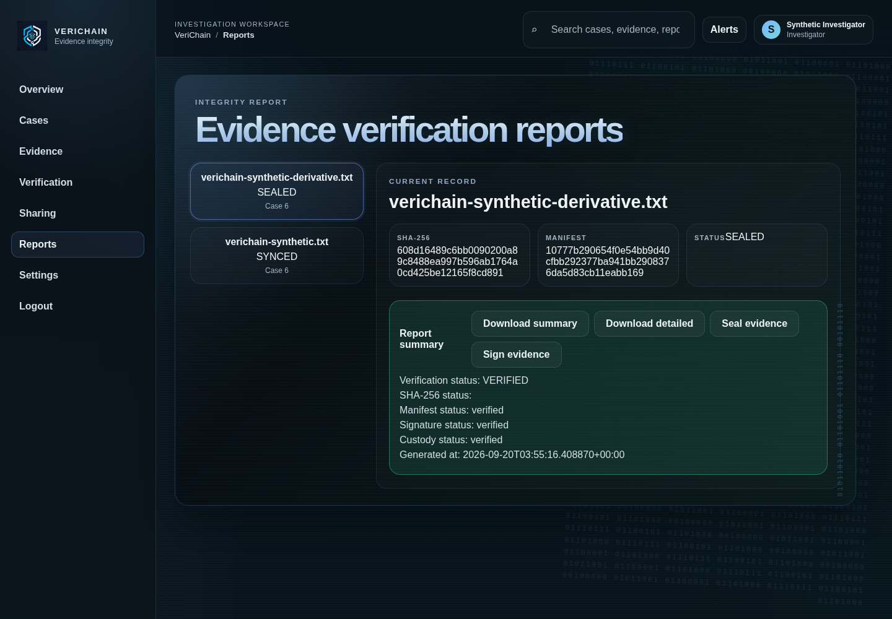

<div align="center">


# VeriChain

### **Prove your digital evidence hasn't changed.**

Cryptographic digital evidence integrity and chain-of-custody platform for preserving, verifying, and securely sharing digital evidence — online or offline.

<br />


<br /><br />

## 🧰 Technology Stack

### Frontend


### Backend


### Desktop


### Data & Storage


### Cryptography & Security


### Tooling


</div>

---

## Quickstart

VeriChain is a functional FastAPI + React web application. The shortest reliable evaluation path is:

```bash
git clone https://github.com/alhemdrew/verichain.git
cd verichain
python3 -m venv apps/api/.venv
apps/api/.venv/bin/python -m pip install -r apps/api/requirements.txt
cp .env.example apps/api/.env
```

Edit `apps/api/.env` and set a non-empty local `SECRET_KEY`. The default judge-friendly SQLite configuration is:

```dotenv
ENV=development
DATABASE_URL=sqlite:///./verichain_local.db
SECRET_KEY=replace-with-a-long-random-local-value
FRONTEND_URL=http://localhost:5173
CORS_ORIGINS=http://localhost:5173
SEED_DEMO_ACCOUNTS=false
```

Start the API in one terminal:

```bash
cd apps/api
.venv/bin/python -m uvicorn app.main:app --host 127.0.0.1 --port 8000
```

Start the web app in a second terminal:

```bash
cd apps/web
npm ci
npm run dev -- --host 127.0.0.1
```

Open <http://localhost:5173>, register a fictional investigator, and follow the [synthetic walkthrough](docs/screenshots.md). The API health check is <http://localhost:8000/health> and should return `{"status":"ok"}`.
For Windows PowerShell commands, troubleshooting, and the platform boundary, read [docs/windows.md](docs/windows.md).

> **Safety boundary:** use synthetic files and reserved example addresses only. VeriChain preserves and verifies digital-object integrity; it does not prove that an underlying real-world event occurred.

# 🔐 VeriChain

## **Digital evidence should not require blind trust.**

VeriChain is a cryptographic digital evidence integrity and chain-of-custody platform designed to help investigators, journalists, legal teams, security professionals, and organizations **collect, preserve, verify, and securely share digital evidence without losing trust in its history.**

From the moment evidence is collected, VeriChain establishes a cryptographic identity for the artifact and records its lifecycle through a tamper-evident custody chain.

> **The file is the evidence.
> The hash proves its identity.
> The custody chain proves its history.**

---

|     | Capability                  |                                      |
| --- | --------------------------- | ------------------------------------ |
| 🔐  | **Cryptographic Integrity** | SHA-256 evidence fingerprinting      |
| 🔏  | **Digital Signatures**      | Ed25519 signed manifests             |
| 🔗  | **Chain of Custody**        | Hash-linked append-only lifecycle    |
| 📴  | **Offline Collection**      | Secure local evidence vault          |
| 🔄  | **Synchronization**         | Offline → online recovery            |
| 👥  | **Secure Sharing**          | Permission-controlled access         |
| 🧬  | **Provenance**              | Cryptographically linked derivatives |
| 🛡️ | **Verification**            | Multi-layer integrity validation     |

---

# 🎯 The Problem

Digital evidence is easy to copy, alter, replace, rename, or redistribute.

A video can be edited.

A screenshot can be manipulated.

A document can be replaced.

And after an evidence file passes through several people or systems, answering **"what exactly happened to this file?"** can become difficult.

Traditional storage tells you where the file exists.

VeriChain is designed to answer a different question:

> ### **Can we demonstrate that the evidence we have now corresponds to the evidence that was originally collected, and can we show its recorded history?**

---

# Evidence Lifecycle

VeriChain treats an evidence record as an immutable reference to specific bytes, together with the metadata and custody events needed to understand how that record was handled. The lifecycle is:



### Collection

The application accepts an uploaded file and records its filename, media type, size, case, organization, and creator. The original bytes are written to local storage without changing their content. Metadata edits are deliberately separate from evidence-byte identity.

### Hashing

VeriChain calculates a SHA-256 digest from the actual bytes. The digest is a compact fingerprint: if the bytes change, the calculated value should change. A hash does not describe whether the content is truthful; it describes whether the content matches the recorded bytes.

### Manifest creation

The canonical manifest binds the evidence ID, case and organization, filename, media type, size, collection time, collector, and SHA-256 value. Its canonical JSON representation is hashed as the manifest digest, giving verification a stable representation of the record metadata.

### Signing

When signing is requested or enabled by configuration, VeriChain signs the canonical evidence manifest with Ed25519. The signature is an authenticity and integrity check for the signed record under the configured key; it is not a statement about the truth of the event shown by the file.

### Preservation

The original file remains in local evidence storage. The optional local vault stores an encrypted copy using the repository's AES-GCM service. Sealing records the evidence digest and manifest digest; it does not rewrite the original bytes.

### Custody recording

Lifecycle actions such as creation, sealing, signing, verification, sharing, and synchronization create custody or audit records. Custody events are linked and can be checked as a chain. The chain records what VeriChain observed through its API; it does not independently prove what happened outside the system.

### Verification

Verification recalculates the current file digest, checks the manifest, validates an available signature, and verifies the custody chain. A mismatch is reported as a failure or no-match result. Missing artifacts are reported as unavailable or incomplete rather than being promoted to a successful verification.

# Security Architecture

VeriChain uses several related but distinct controls:

| Control | What it protects | How verification uses it |
| --- | --- | --- |
| SHA-256 | The identity of the recorded bytes | Rehashes the current bytes and compares the result with the recorded digest. |
| Canonical manifest | The evidence metadata and its relationship to the digest | Rebuilds the canonical record and compares its manifest digest. |
| Ed25519 signature | The signed manifest against unauthorized alteration | Uses the stored public key to validate the signature over the canonical payload. |
| Custody chain | The order and linkage of recorded lifecycle events | Recomputes event links and reports whether the chain is valid. |
| Provenance links | Parent-child relationships between original and derivative evidence | Confirms that a derivative points to its recorded parent without replacing the parent. |

These controls complement one another. A matching SHA-256 value does not prove that a signature exists, and a valid signature does not make a modified file valid if the current bytes no longer match the signed record. Reports therefore expose separate hash, manifest, signature, custody, synchronization, and provenance states.

When a required check fails, the API returns a failed verification state and the UI presents the mismatch. When a required artifact is missing, the result is unavailable or incomplete. VeriChain does not silently convert either condition into `VERIFIED`.

# Offline Preservation and Synchronization

The currently verified offline path is the API/local-storage workflow, not a full browser PWA. Evidence can be preserved locally with a `LOCAL_ONLY` synchronization state, and the application can later submit the original bytes and recorded metadata to the synchronization endpoint.

The workflow is:

1. Evidence is collected and written to local storage.
2. The local record retains its evidence ID, original hash, manifest information, and pending synchronization state.
3. If configured, an encrypted local-vault copy can provide an additional preservation layer.
4. When connectivity is available, synchronization submits the original bytes and record identifiers.
5. The server recalculates the uploaded SHA-256 value and validates organization, case, manifest, signature, and local content consistency.
6. A successful request changes the record to `SYNCED`; failures remain observable and can be retried through the synchronization workflow.

The server does not trust a client-provided hash by itself. It compares the claimed value with the bytes received. Offline browser persistence through IndexedDB, background sync, and a packaged desktop experience are not currently claimed as complete features.



# Evidence Provenance

A derivative is a new evidence object, not a rewritten version of its parent. For example:



Each derivative receives its own evidence ID, byte digest, manifest, and storage reference. The provenance record stores the parent ID, derivation type, description, and creation time. A reviewer can therefore verify the derivative separately while still navigating back to the original.

The relationship proves that VeriChain recorded a declared parent-child link. It does not prove that the transformation was semantically correct, that redaction removed every sensitive detail, or that the source event represented by either file was truthful.



# Workflow Screens

The reviewed screenshots below show the main application surfaces using synthetic data. They are documentation artifacts, not claims about real people, cases, or evidence.

| Stage | Screenshot | What to look for |
| --- | --- | --- |
| Access | [Login](docs/screenshots/01-login-page.png) | Authentication entry point and VeriChain identity. |
| Workspace | [Dashboard](docs/screenshots/02-dashboard.png) | Case/evidence counts and synchronization status. |
| Case setup | [Case list](docs/screenshots/03-case-created.png) | Organization-scoped case numbering. |
| Registration | [Evidence upload](docs/screenshots/04-evidence-upload.png) | File registration and preservation controls. |
| Evidence | [Evidence detail](docs/screenshots/05-evidence-detail.png) | Recorded integrity states and custody actions. |
| Verification | [Verification](docs/screenshots/06-verification.png) | Presented-file verification with explicit pending state. |
| Sharing | [Sharing controls](docs/screenshots/08-sharing-controls.png) | Recipient lookup, permissions, expiry, and delivery action. |
| Reporting | [Reports](docs/screenshots/09-reports-page.png) | In-app report state and PDF download actions. |
| Profile | [Settings](docs/screenshots/10-settings-profile.png) | Investigator identity and account controls. |
| PDF output | [Summary report](docs/screenshots/13-summary-report.png) and [detailed report](docs/screenshots/14-detailed-report.png) | Rendered report layout, status, and technical evidence. |

The complete screenshot index and limitations are documented in [docs/screenshots.md](docs/screenshots.md).

---

# 🏗️ Architecture

The functional product is a React web client backed by a FastAPI service. The API owns authentication, organization authorization, evidence records, custody events, signatures, reports, sharing, derivatives, and synchronization. Local storage and the optional encrypted vault preserve bytes close to the API process; PostgreSQL is available through the Docker configuration for a multi-service development setup.



The Tauri node is intentionally shown as a scaffold rather than a supported desktop runtime. The browser/API workflow is the current functional surface.

---

# 📦 Project Structure

```text
verichain/
│
├── apps/
│   ├── api/                  # FastAPI backend
│   ├── web/                  # React web application
│   └── desktop/              # Tauri desktop application
│
├── packages/
│   ├── types/                # Shared TypeScript types
│   └── ui/                   # Shared UI package scaffold
│
├── docs/
│   ├── architecture.md
│   ├── threat-model.md
│   ├── crypto-model.md
│   ├── evidence-lifecycle.md
│   └── api.md
│
├── docker/
├── logos/
│   ├── icon logo.png
│   ├── primary horizontal logo.png
│   ├── stacked logo.png
│   └── standalone logo.png
│
├── README.md
└── .env.example
```

---

# 🧪 Engineering Status

## ✉️ Email Sharing

Evidence sharing creates an authorization-controlled share first, then sends an email through the configured SMTP provider. The original evidence is never attached to the email; the message contains a VeriChain link and the recorded permissions/expiry.

To enable delivery in a local `.env`, configure `SMTP_HOST`, `SMTP_PORT`, `SMTP_FROM_EMAIL`, and, when required by the provider, `SMTP_USERNAME`, `SMTP_PASSWORD`, and `SMTP_USE_TLS`. If SMTP is not configured or the provider rejects the message, VeriChain reports that state and does not claim the email was sent. See `.env.example` for the complete template.

<div align="center">

| Validation            |            Result |
| --------------------- | ----------------: |
| Backend Tests         |   ✅ **61 passed** |
| Frontend Build        |     ✅ **Passing** |
| TypeScript            |     ✅ **Passing** |
| Secret Protection     |    ✅ **Verified** |
| Offline Evidence      | ✅ **Implemented** |
| Cryptographic Sealing | ✅ **Implemented** |
| Chain of Custody      | ✅ **Implemented** |
| Digital Signatures    | ✅ **Implemented** |
| Secure Sharing        | ✅ **Implemented** |
| Provenance            | ✅ **Implemented** |
| GitHub Actions        | ✅ **Backend + frontend checks** |
| Tauri desktop         | ⚠️ **Scaffold only** |

</div>

## 📸 Demonstration Screenshots

The application was exercised with synthetic case `CASE-0001` and synthetic evidence. A short showcase is included below; the complete reviewed capture index is in [docs/screenshots.md](docs/screenshots.md).

<p align="center">
      
      
      
</p>

<p align="center">
      
      
      
      
</p>

## 🧪 Synthetic Data Statement

All evidence used in this demonstration is synthetic and was created specifically for testing VeriChain's evidence-integrity and chain-of-custody workflows. No real personal data is used.

## 🖥️ Development Requirements

- Linux development was verified with Python 3.12, Node.js 18, and npm 9.
- Copy `.env.example` to `apps/api/.env`; configure `SECRET_KEY`, `DATABASE_URL`, `FRONTEND_URL`, and `CORS_ORIGINS` before starting the API.
- Backend: `cd apps/api && .venv/bin/python -m pytest -q`
- Frontend: `cd apps/web && npm install && npm run dev`
- Frontend validation: `cd apps/web && npm run build && npx tsc --noEmit`
- Optional SMTP delivery requires the `SMTP_*` values documented in `.env.example`. No provider delivery was claimed in the local demo.
- Demo-account seeding is disabled by default. For an isolated local demonstration only, set `SEED_DEMO_ACCOUNTS=true`; never use seeded credentials in a public deployment.
- The Docker Compose file provisions PostgreSQL and the API service, but Docker deployment is not claimed as tested in this Linux session.

### Windows

The application code avoids Linux-only storage paths, but Windows packaging was not tested in this Linux environment. The Tauri directory is currently a scaffold, so no Windows installer or desktop build is claimed. Validate the web/API workflow on Windows first, then install Rust and the Tauri CLI before attempting a desktop build.

## Project Status

The web/API prototype supports authentication, organization-scoped cases, evidence preservation, SHA-256 sealing, Ed25519 signing, custody verification, derivatives, sharing, SMTP-backed share notifications, offline/local evidence, synchronization, and integrity reports. The browser/API workflow was exercised on Linux; Windows CI checks are configured but a native Windows manual run has not been performed. Production deployment still requires hardened key management, provider configuration, operational monitoring, upload limits, and a completed desktop packaging path.

---

# 🚧 Roadmap

```text
FOUNDATION
    │
    ├── Authentication
    ├── Evidence Core
    ├── Cryptographic Sealing
    ├── Chain of Custody
    ├── Digital Signatures
    ├── Offline Vault
    ├── Synchronization
    ├── Secure Sharing
    └── Provenance
             │
             ▼
       NEXT GENERATION
             │
             ├── Forensic Reports
             ├── Desktop Release
             ├── Production Key Management
             ├── Object Storage
             ├── Advanced Verification
             └── Production Hardening
```

---

# ⚠️ Security & Trust Boundary

VeriChain is designed to provide cryptographic evidence integrity and a verifiable record of recorded custody events.

It does **not** claim to prove that the underlying real-world event itself occurred.

For example:

```text
SHA-256 MATCH
      ≠
REAL-WORLD TRUTH
```

A matching fingerprint demonstrates that the current bytes correspond to the recorded fingerprint.

It does not independently establish the authenticity of the original source, the honesty of the collector, or the truthfulness of the event represented by the evidence.

VeriChain also does not claim to completely protect evidence against a fully compromised operating system, compromised source device, compromised signing keys, or physical destruction.

---

# 🤝 Development Principles

VeriChain follows several non-negotiable principles:

* **Original evidence is never silently modified.**
* **Evidence identity is immutable.**
* **Verification failures are never represented as successful verification.**
* **Custody history is append-only.**
* **Evidence sharing is authorization-controlled.**
* **Secrets and private keys never belong in Git.**
* **Established cryptographic libraries are preferred over custom cryptography.**
* **Offline collection must remain possible when connectivity is unavailable.**
* **Organization boundaries must be enforced server-side.**
* **Security-sensitive functionality must be tested.**

---

# 📜 License

License information will be added before the public release.

---

<div align="center">


### **VERIFY THE FILE.**

### **VERIFY THE HISTORY.**

`COLLECT` · `HASH` · `SEAL` · `SIGN` · `PRESERVE` · `VERIFY`

<br />

**VeriChain — Digital Evidence Integrity Infrastructure**

</div>
