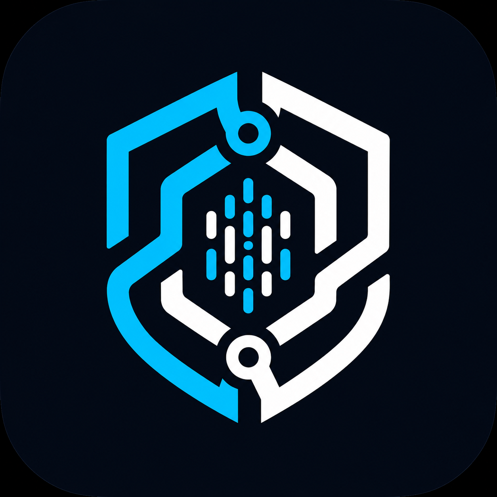
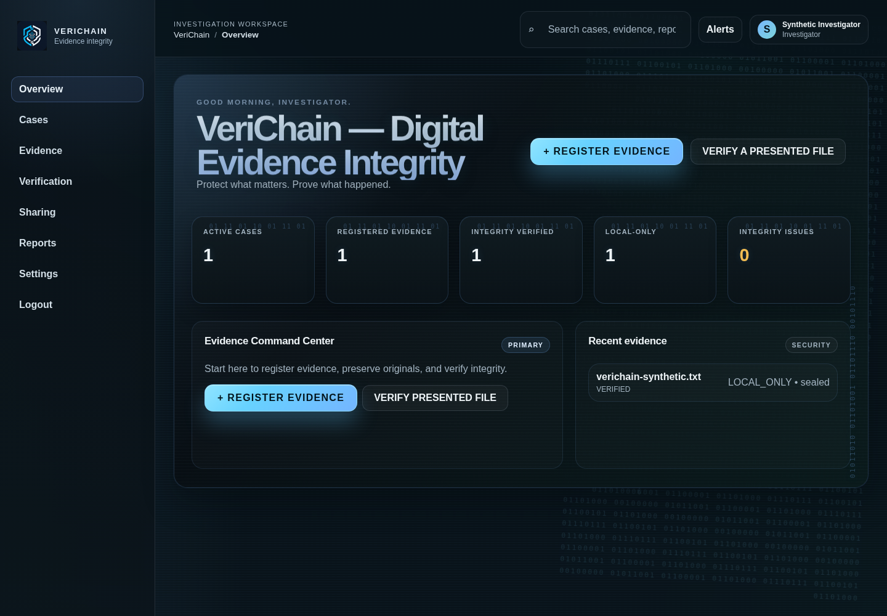
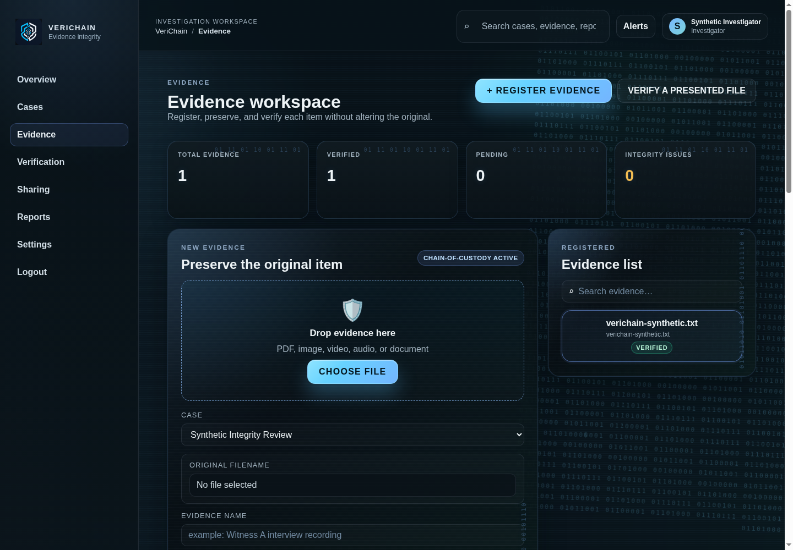
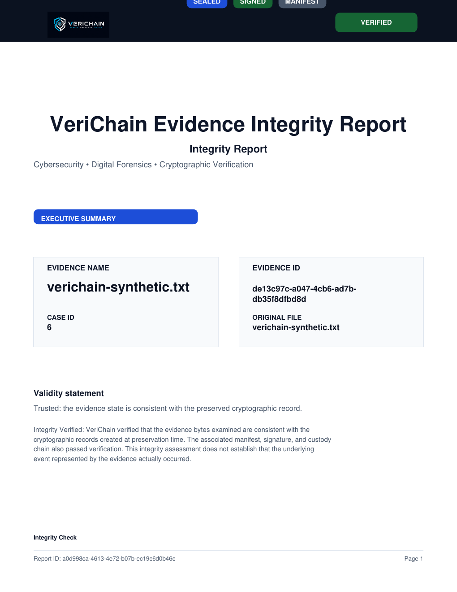

<div align="center">



# VeriChain

### **Prove your digital evidence hasn't changed.**

Cryptographic digital evidence integrity and chain-of-custody platform for preserving, verifying, and securely sharing digital evidence — online or offline.

<br />


<br /><br />

## 🧰 Technology Stack

### Frontend


### Backend


### Desktop


### Data & Storage


### Cryptography & Security


### Tooling


</div>

---

## Judge Quickstart

VeriChain is a functional FastAPI + React web application. The shortest reliable evaluation path is:

```bash
git clone https://github.com/alhemdrew/verichain.git
cd verichain
python3 -m venv apps/api/.venv
apps/api/.venv/bin/python -m pip install -r apps/api/requirements.txt
cp .env.example apps/api/.env
```

Edit `apps/api/.env` and set a non-empty local `SECRET_KEY`. The default judge-friendly SQLite configuration is:

```dotenv
ENV=development
DATABASE_URL=sqlite:///./verichain_local.db
SECRET_KEY=replace-with-a-long-random-local-value
FRONTEND_URL=http://localhost:5173
CORS_ORIGINS=http://localhost:5173
SEED_DEMO_ACCOUNTS=false
```

Start the API in one terminal:

```bash
cd apps/api
.venv/bin/python -m uvicorn app.main:app --host 127.0.0.1 --port 8000
```

Start the web app in a second terminal:

```bash
cd apps/web
npm ci
npm run dev -- --host 127.0.0.1
```

Open <http://localhost:5173>, register a fictional investigator, and follow the [synthetic judge walkthrough](docs/screenshots.md). The API health check is <http://localhost:8000/health> and should return `{"status":"ok"}`.
│   └── ui/                   # Shared UI package scaffold
For Windows PowerShell commands, troubleshooting, and the platform boundary, read [docs/windows.md](docs/windows.md).

> **Safety boundary:** use synthetic files and reserved example addresses only. VeriChain preserves and verifies digital-object integrity; it does not prove that an underlying real-world event occurred.

# 🔐 VeriChain

## **Digital evidence should not require blind trust.**

VeriChain is a cryptographic digital evidence integrity and chain-of-custody platform designed to help investigators, journalists, legal teams, security professionals, and organizations **collect, preserve, verify, and securely share digital evidence without losing trust in its history.**

From the moment evidence is collected, VeriChain establishes a cryptographic identity for the artifact and records its lifecycle through a tamper-evident custody chain.

> **The file is the evidence.
> The hash proves its identity.
> The custody chain proves its history.**

---

|     | Capability                  |                                      |
| --- | --------------------------- | ------------------------------------ |
| 🔐  | **Cryptographic Integrity** | SHA-256 evidence fingerprinting      |
| 🔏  | **Digital Signatures**      | Ed25519 signed manifests             |
| 🔗  | **Chain of Custody**        | Hash-linked append-only lifecycle    |
| 📴  | **Offline Collection**      | Secure local evidence vault          |
| 🔄  | **Synchronization**         | Offline → online recovery            |
| 👥  | **Secure Sharing**          | Permission-controlled access         |
| 🧬  | **Provenance**              | Cryptographically linked derivatives |
| 🛡️ | **Verification**            | Multi-layer integrity validation     |

---

# 🎯 The Problem

Digital evidence is easy to copy, alter, replace, rename, or redistribute.

A video can be edited.

A screenshot can be manipulated.

A document can be replaced.

And after an evidence file passes through several people or systems, answering **"what exactly happened to this file?"** can become difficult.

Traditional storage tells you where the file exists.

VeriChain is designed to answer a different question:

> ### **Can we demonstrate that the evidence we have now corresponds to the evidence that was originally collected, and can we show its recorded history?**

---

# 🧠 The VeriChain Model

```text
COLLECT
   │
   ▼
FINGERPRINT
   │
   ▼
MANIFEST
   │
   ▼
SIGN
   │
   ▼
SEAL
   │
   ▼
CUSTODY CHAIN
   │
   ├───────────────┐
   ▼               ▼
OFFLINE          ONLINE
VAULT            STORAGE
   │               │
   └───────┬───────┘
           ▼
        VERIFY
           │
           ▼
     TRUSTED RECORD
```

---

# 🔬 Security Architecture

VeriChain combines several independent integrity mechanisms:

```text
                  ┌──────────────────────┐
                  │    EVIDENCE BYTES    │
                  └──────────┬───────────┘
                             │
                             ▼
                       ┌───────────┐
                       │ SHA-256   │
                       └─────┬─────┘
                             │
                             ▼
                       ┌───────────┐
                       │ MANIFEST  │
                       └─────┬─────┘
                             │
                             ▼
                       ┌───────────┐
                       │ Ed25519   │
                       │ SIGNATURE │
                       └─────┬─────┘
                             │
                             ▼
                       ┌───────────┐
                       │  CUSTODY  │
                       │   CHAIN   │
                       └─────┬─────┘
                             │
                             ▼
                       ┌───────────┐
                       │PROVENANCE │
                       └─────┬─────┘
                             │
                             ▼
                         VERIFY
```

---

# 📴 Offline → Online

Connectivity should not determine whether evidence can be preserved.

VeriChain can collect and protect evidence locally before connectivity returns.

```text
┌─────────────┐
│   OFFLINE   │
└──────┬──────┘
       │
       ▼
   Collect
       │
       ▼
    SHA-256
       │
       ▼
   Sign + Seal
       │
       ▼
 Encrypted Vault
       │
       ▼
   Sync Queue
       │
       │ INTERNET RETURNS
       ▼
 Secure Synchronization
       │
       ▼
 Server Verification
```

---

# 🧬 Evidence Provenance

Original evidence remains distinct from derivatives.

```text
                   ORIGINAL
                      │
                 Evidence A
                      │
                ──────┴──────
                      │
                 DERIVATION
                ╱           ╲
               ▼             ▼
        Evidence B       Evidence C
        Screenshot       Redacted Copy
```

Every derivative receives its own cryptographic identity while retaining an explicit relationship to its parent.

---

# 🏗️ Architecture

```text
┌─────────────────────────────────────────────────────────┐
│                      VERICHAIN                          │
│                                                         │
│   React Web                  Tauri Desktop              │
│       │                           │                     │
│       └────────────┬──────────────┘                     │
│                    ▼                                    │
│               FastAPI API                               │
│                    │                                    │
│        ┌───────────┼────────────┐                       │
│        ▼           ▼            ▼                       │
│    Evidence     Security      Sync                      │
│    Services     Services     Services                    │
│        │           │            │                       │
│        └───────────┼────────────┘                       │
│                    ▼                                    │
│              Data / Storage                             │
│              ┌───────────┐                              │
│              │PostgreSQL │                              │
│              └───────────┘                              │
│                                                         │
│              Local Offline Layer                        │
│              ┌───────────┐                              │
│              │  SQLite   │                              │
│              │Encrypted  │                              │
│              │   Vault   │                              │
│              └───────────┘                              │
└─────────────────────────────────────────────────────────┘
```

---

# 📦 Project Structure

```text
verichain/
│
├── apps/
│   ├── api/                  # FastAPI backend
│   ├── web/                  # React web application
│   └── desktop/              # Tauri desktop application
│
├── packages/
│   ├── types/                # Shared TypeScript types
│   └── ui/                   # Shared UI package scaffold
│
├── docs/
│   ├── architecture.md
│   ├── threat-model.md
│   ├── crypto-model.md
│   ├── evidence-lifecycle.md
│   └── api.md
│
├── docker/
├── logos/
│   ├── icon logo.png
│   ├── primary horizontal logo.png
│   ├── stacked logo.png
│   └── standalone logo.png
│
├── README.md
└── .env.example
```

---

# 🧪 Engineering Status

## ✉️ Email Sharing

Evidence sharing creates an authorization-controlled share first, then sends an email through the configured SMTP provider. The original evidence is never attached to the email; the message contains a VeriChain link and the recorded permissions/expiry.

To enable delivery in a local `.env`, configure `SMTP_HOST`, `SMTP_PORT`, `SMTP_FROM_EMAIL`, and, when required by the provider, `SMTP_USERNAME`, `SMTP_PASSWORD`, and `SMTP_USE_TLS`. If SMTP is not configured or the provider rejects the message, VeriChain reports that state and does not claim the email was sent. See `.env.example` for the complete template.

<div align="center">

| Validation            |            Result |
| --------------------- | ----------------: |
| Backend Tests         |   ✅ **61 passed** |
| Frontend Build        |     ✅ **Passing** |
| TypeScript            |     ✅ **Passing** |
| Secret Protection     |    ✅ **Verified** |
| Offline Evidence      | ✅ **Implemented** |
| Cryptographic Sealing | ✅ **Implemented** |
| Chain of Custody      | ✅ **Implemented** |
| Digital Signatures    | ✅ **Implemented** |
| Secure Sharing        | ✅ **Implemented** |
| Provenance            | ✅ **Implemented** |
| GitHub Actions        | ✅ **Backend + frontend checks** |
| Tauri desktop         | ⚠️ **Scaffold only** |

</div>

## 📸 Demonstration Screenshots

The application was exercised with synthetic case `CASE-0001` and synthetic evidence. A short showcase is included below; the complete reviewed capture index is in [docs/screenshots.md](docs/screenshots.md).

<p align="center">
      
      
      
</p>

## 🧪 Synthetic Data Statement

All evidence used in this demonstration is synthetic and was created specifically for testing VeriChain's evidence-integrity and chain-of-custody workflows. No real personal data is used.

## 🖥️ Development Requirements

- Linux development was verified with Python 3.12, Node.js 18, and npm 9.
- Copy `.env.example` to `apps/api/.env`; configure `SECRET_KEY`, `DATABASE_URL`, `FRONTEND_URL`, and `CORS_ORIGINS` before starting the API.
- Backend: `cd apps/api && .venv/bin/python -m pytest -q`
- Frontend: `cd apps/web && npm install && npm run dev`
- Frontend validation: `cd apps/web && npm run build && npx tsc --noEmit`
- Optional SMTP delivery requires the `SMTP_*` values documented in `.env.example`. No provider delivery was claimed in the local demo.
- Demo-account seeding is disabled by default. For an isolated local demonstration only, set `SEED_DEMO_ACCOUNTS=true`; never use seeded credentials in a public deployment.
- The Docker Compose file provisions PostgreSQL and the API service, but Docker deployment is not claimed as tested in this Linux session.

### Windows

The application code avoids Linux-only storage paths, but Windows packaging was not tested in this Linux environment. The Tauri directory is currently a scaffold, so no Windows installer or desktop build is claimed. Validate the web/API workflow on Windows first, then install Rust and the Tauri CLI before attempting a desktop build.

## Project Status

The web/API prototype supports authentication, organization-scoped cases, evidence preservation, SHA-256 sealing, Ed25519 signing, custody verification, derivatives, sharing, SMTP-backed share notifications, offline/local evidence, synchronization, and integrity reports. The browser/API workflow was exercised on Linux; Windows CI checks are configured but a native Windows manual run has not been performed. Production deployment still requires hardened key management, provider configuration, operational monitoring, upload limits, and a completed desktop packaging path.

---

# 🚧 Roadmap

```text
FOUNDATION
    │
    ├── Authentication
    ├── Evidence Core
    ├── Cryptographic Sealing
    ├── Chain of Custody
    ├── Digital Signatures
    ├── Offline Vault
    ├── Synchronization
    ├── Secure Sharing
    └── Provenance
             │
             ▼
       NEXT GENERATION
             │
             ├── Forensic Reports
             ├── Desktop Release
             ├── Production Key Management
             ├── Object Storage
             ├── Advanced Verification
             └── Production Hardening
```

---

# ⚠️ Security & Trust Boundary

VeriChain is designed to provide cryptographic evidence integrity and a verifiable record of recorded custody events.

It does **not** claim to prove that the underlying real-world event itself occurred.

For example:

```text
SHA-256 MATCH
      ≠
REAL-WORLD TRUTH
```

A matching fingerprint demonstrates that the current bytes correspond to the recorded fingerprint.

It does not independently establish the authenticity of the original source, the honesty of the collector, or the truthfulness of the event represented by the evidence.

VeriChain also does not claim to completely protect evidence against a fully compromised operating system, compromised source device, compromised signing keys, or physical destruction.

---

# 🤝 Development Principles

VeriChain follows several non-negotiable principles:

* **Original evidence is never silently modified.**
* **Evidence identity is immutable.**
* **Verification failures are never represented as successful verification.**
* **Custody history is append-only.**
* **Evidence sharing is authorization-controlled.**
* **Secrets and private keys never belong in Git.**
* **Established cryptographic libraries are preferred over custom cryptography.**
* **Offline collection must remain possible when connectivity is unavailable.**
* **Organization boundaries must be enforced server-side.**
* **Security-sensitive functionality must be tested.**

---

# 📜 License

License information will be added before the public release.

---

<div align="center">


### **VERIFY THE FILE.**

### **VERIFY THE HISTORY.**

`COLLECT` · `HASH` · `SEAL` · `SIGN` · `PRESERVE` · `VERIFY`

<br />

**VeriChain — Digital Evidence Integrity Infrastructure**

</div>
